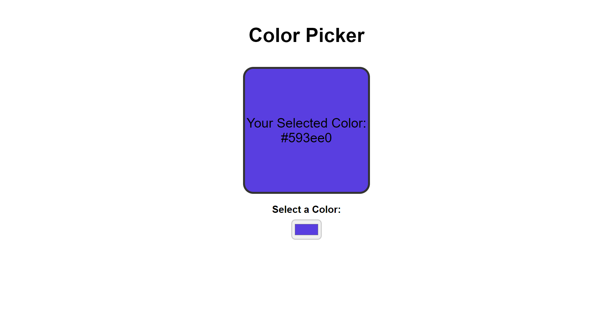

# Color Picker React Component

This is a simple Color Picker component built using React. It allows users to select a color from a color input and displays the selected color dynamically.

## Features

- Displays the selected color in real-time.
- Allows users to choose any color using the color input.

## Installation

To use this component in your React application, follow these steps:

1. Save the following files into your `src/` folder in your React project directory:
   
   - `App.jsx`(as ColorPicker files is linked to this)
   - `ColorPicker.jsx`
   - `index.css` (if styling is separate)

3. Ensure you have React set up and configured in your project.

## Preview

